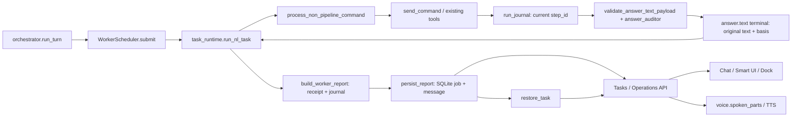

# IRU P0 — целостность результата и стабилизация существующих контрактов

Дата аудита: 10 октября 2026. Ветка: `codex/agentshell-webview`.
Исходный локальный HEAD: `23c454a`. После независимого review рабочие файлы согласованы с проверенным origin `c6a2899ffec63a49f43f5e339a954b21417add60`; новый экспорт diff использует этот SHA. Локальный HEAD не перемещался. Фактический checkout: `C:\Users\russa\OneDrive\Desktop\ИРУ\IRU`.
Изменений архитектуры, зависимостей, разрешений, режимов и дополнительных LLM-вызовов нет.
Коммиты, push, merge и PR не выполнялись.

## A. Фактическая цепочка и подтверждение причин

Orchestrator принимает исходную реплику и ограниченное решение; Worker получает исходную цель, ограниченную историю и ссылки на разрешённые результаты. `worker_context` помечает историю как данные, не разрешения и не доказательства текущего запуска. `run_journal` присваивает шагам текущие `step_id`. Контроллер проверяет структуру терминального ответа и применяет существующий семантический аудитор до записи `answer.text`.

В non-pipeline ответе receipt может отсутствовать, если аудитор отключён или ответ не описывает внешний результат. Для принятого включённым аудитором grounded/partial/error терминала контроллер теперь выдаёт существующий task_receipt с answer_source=audited_terminal. В таком случае WorkerReport опирается на терминальный журнал. Pipeline и продолжение подтверждённой команды используют существующий receipt. Успешность shell-команды, наблюдение, достижение цели и пригодность текста для представления проверяются отдельно.

### Конфликтующие контракты

| Компонент | До исправления | Конфликт / сохранённая граница |
|---|---|---|
| `execute_cmd_result_is_ok` | rc=0 и `OK:` | Маркер для action success сохранён; завершённый receipt и тип кода теперь согласованы с confirmed_command_outcome. |
| `confirmed_command_outcome` | Без `OK:` — unknown; launch-only не успех | Продолжение разрешённого действия не подтверждает всю первоначальную цель. Не изменено. |
| `positive_evidence` | Для любого execute_cmd требовал подтверждение действия | Информационный shell-вывод не попадал в доказательства WorkerReport. |
| `has_grounded_terminal_answer` | Точный текст, grounded_report, валидный текущий basis, учёт невосстановленных ошибок | Markdown-очистка разрушала точную идентичность. Защита сохранена. |
| `build_worker_report` | Сначала требовал positive_evidence, затем grounded terminal | Валидное наблюдение без action marker становилось unknown. |
| `task_runtime` | Повторная legacy-проверка и strip_markdown после контроллера | Менял текст после аудита; partial/unknown receipt превращались в runtime done. |
| `worker_presentation` | Для partial показывал общую фразу / тип артефакта | Проверенный содержательный partial_report оставался только в деталях. |
| `Smart UI.taskState` | Повторно агрегировал статусы даже при наличии WorkerReport | Старые вложенные шаги могли понизить уже определённый сервером итог. |
| `persist_report / restore_task` | В job оставался admission payload; итог зависел от строки messages | Утрата строки истории уничтожала текст и журнал, оставляя успешную сводку отчёта. |
| Tasks API | Индексировал обязательными поля оформления из optional history_metadata | Отсутствующие taskMode/taskElapsedMs давали KeyError вместо ответа. |
| Orchestrator presentation | Ошибка подготовки голоса попадала в общий exception | Принятое решение отменялось необязательным голосовым сбоем. |
| Desktop location presentation | Lookup профиля без локальной защиты | Недоступная необязательная подсказка места блокировала полезный результат. |

### Воспроизводимые дефекты и риски

| Дефект | Подтверждение до исправления | Исправление | Риск |
|---|---|---|---|
| Информационный rc=0 без OK становится unknown | 4 параметра lifecycle-теста упали: unknown вместо success | Для валидного informational grounded_report проверяются все basis-наблюдения и server receipt включённого аудита исходной цели; action confirmation сохранена | Средний: различение наблюдения и действия; покрыты отрицательные варианты |
| Markdown теряет идентичность | run_nl_task вернул OBSERVED вместо исходного Markdown | Безопасный терминальный текст сохраняется точно; содержимое проходит trust guard, исходный payload остаётся в журнале даже при отказе | Низкий: форматирование вынесено из проверки, подмена текста отклоняется |
| Partial/unknown receipt становится done | Исходная run_nl_task из HEAD дала done для двух receipt-статусов; исправленная функция сохранила оба | Прямое сохранение существующих partial/unknown статусов | Низкий; тест восстановления completed_with_recovery сохранён |
| Посторонний OK подтверждает чужой basis | Исходный build_worker_report из HEAD дал success при basis только из process-started шага | В grounded action проверяются успешные доказательства именно basis, а не наличие любого OK в журнале | Средний; защита от ложного успеха усилена |
| Частичный ответ скрыт | partial_report заменён общим итогом об артефакте | Показ точного валидного partial/error/clarification текста только при совпадении типа с итоговым статусом | Низкий: статус не повышается |
| UI повторно решает итог | JS-тест дал failed вместо серверного success | WorkerReport v1 определяет UI-статус; legacy сообщения используют прежний адаптер | Средний: ответственность за достоверность остаётся у серверного отчёта |
| Повреждённые optional поля API | KeyError taskMode | Текущая metadata как база, типизированные допустимые старые поля как оформление | Низкий; сохранён существующий контракт исторической отмены |
| Voice projection отменяет решение | 2 теста потеряли исходный ответ; stage=presentation | Локальный voice_presentation error в существующем журнале | Низкий; исключения исполнения и разрешений не перехватываются этой защитой |
| Desktop profile блокирует результат | RuntimeError из _desktop_location | Сохраняется подтверждённый результат, опускается только необязательная подсказка места; лог типа сбоя | Низкий; новый путь/факт не выдумывается |
| Отказ от команды Worker отображался как unknown | Связанный сценарий 20: ноль dispatch, но WorkerReport unknown после accepted=false | Существующий mark_task_cancelled и cancelled receipt для Worker; nonce/permission logic не менялась | Низкий; сохранены legacy non-worker контракт и повторное подтверждение нового поручения |
| Длинный partial_report вызывал редакторскую модель для голоса | Дополнительный связанный тест зафиксировал вызов editor при корректном partial | Голос использует существующее краткое структурированное представление; полный terminal остаётся в чате | Низкий; статус не переоценивается, явно запрошенная полная озвучка сохраняется |
| Потеря final snapshot / раздельные записи | После удаления messages restore_task потерял answer/commands | Финальный job snapshot и доступная история сохраняются общей транзакцией. Ошибка вторичной истории откатывается до savepoint; snapshot остаётся авторитетным. Legacy восстанавливается из истории | Средний: транзакции SQLite; отдельный тест проверяет rollback обеих записей |

Строка «ИРУ завершила задачу без текстового ответа» находится в `ui/js/chat.js`, terminal polling fallback при отсутствии conversational_response и answer. В новых воспроизведённых сценариях обе строки заполнены, fallback не появляется. Read-only проверка локальной `server/iru.db` обнаружила 0 messages и 0 совпадений исходного запроса. Без исходного полного execution trace нельзя доказать, что именно этот fallback в историческом инциденте вызван тем же переходом: это не объявляется установленной причиной. Другой путь пустого ответа есть в старом предложении плана, которое отдельно сохраняет сообщение. Случайные новые фразы и маскировка unknown не добавлены.

## B. Границы исправлений

`has_validated_terminal_answer` в существующем controller_trust проверяет только идентичность текста и структуру текущего терминального payload. Он не устанавливает успех цели. `has_grounded_terminal_answer` по-прежнему отдельно учитывает невосстановленные ошибки и устройства. Семантический аудит остаётся перед записью terminal.

Наблюдение execute_cmd допускается только при успешном journal status, int 0 или прежнем string "0", присутствующем строковом stdout (включая пустую строку), допустимых status/completion_state, отсутствии error/NO/ERROR/launch_requested. Требуются валидный informational terminal, все basis-шаги и server receipt включённого аудита исходной цели. Один claims_completed_action=false от Worker недостаточен; audit receipt не заменяет подтверждение исполнительного действия. Успех отдельного постороннего шага не подтверждает неопределённый basis. Без терминального доказательства rc=0 не становится успехом всей задачи. Код подтверждений, nonce, ограничения устройств, маршруты исполнения и safety checks не изменены.

Новый финальный snapshot использует имеющийся `worker_jobs.payload`. Сериализуются только данные ответа, журнала, receipt и представления, а не locks/events/transports. Записи привязаны к owner и chat. Новый snapshot не зависит от optional history row; старые задания сохраняют совместимость восстановления через messages. Это не новая память или подсистема.

## C. Регрессия и ограничения доказательств

Все **20 обязательных сценариев** теперь проходят связанную регрессию в `tests/test_integrity_lifecycle.py` и `tests/integrity-lifecycle-browser.test.cjs`.

Серверная часть использует настоящий Orchestrator, WorkerScheduler, run_nl_task, process_non_pipeline_command, production command transport, journal, WorkerReport, SQLite, HTTP API и voice endpoint. Внешние решения модели, семантического аудитора, эффекты Windows-устройства и TTS замещены контролируемыми эмуляциями. Для уточнения диалога Worker/receipt/WorkerReport отсутствуют по действующему контракту; проверяется отсутствие dispatch и фиктивной операции в Dock.

Браузерная часть запускает этот серверный набор и получает **его фактические API, history, Operations и восстановленные значения** через временные JSON-артефакты. Production UI в Edge воспроизводит эти снимки; отдельно проверяются точный видимый ответ, один message key на задачу, статус и детали Dock, F5 и смена чата без POST/повторного исполнения. Это связанное воспроизведение серверных данных, а не независимо написанные успешные UI-fixtures. HTTP в браузере воспроизводит снимки; живой backend одновременно с интерфейсом в этом наборе не работает. Существующий browser-bridge тест отдельно использует настоящий FastAPI fixture, WebSocket router и распакованное расширение.

| № | Сценарий | Связанный сервер + браузер | Ограничение реального испытания |
|---|---|---|---|
| 1 | Папки Desktop | Два execute_cmd без OK, terminal basis обоих шагов, report/API/history/voice/restore/F5/Dock | Desktop эмулируется |
| 2 | Чтение заметки | Реальный transport возвращает контролируемое содержимое; полный ответ сохраняется во всех слоях | Пользовательский файл не читался |
| 3 | Свободное место | Числовой shell-вывод, информационный grounded_report и тот же пользовательский результат | Диск не опрашивался |
| 4 | Список окон | Действующий window_control(list), журнал, информационный результат и озвучка | Окна эмулируются |
| 5 | LAN/WAN → «Я про сеть» | Две реальные Orchestrator-реплики, контекст уточнения, ноль Worker/tool dispatch, API/SQLite/voice/F5, пустой Dock | Решения модели эмулируются |
| 6 | Два файла | Два отдельных write_content, проверка обоих путей третьей командой, артефакты/receipt/report/API/history/voice/restore/UI | Файловая система эмулируется и проверяется в fixture |
| 7 | Открыть первый, затем второй | Две последовательные отправки разных команд, доказательства обоих шагов, отчёт и все представления | Приложение не запускается |
| 8 | Закрыть нужный экземпляр | Настоящий WindowControl с эмулируемым native adapter и двумя Notepad: PID 42 закрыт, PID 43 сохранён; voice endpoint — предусмотренная тишина | Native API эмулируется; ambiguous/stale HWND дополнительно покрыты прежними тестами |
| 9 | Действие на конкретном устройстве | window_control(minimize, pid=42) проходит ownership/assignment guards; другое доступное устройство с теми же PID не получает вызовов и не меняется | Устройства/native API эмулируются |
| 10 | Очередь и независимый разговор | Первый Worker удерживается transport gate, второй queued без dispatch; разговор проходит до освобождения; FIFO, report/API/history/voice/restore; браузер проверяет реальные running/queued/final снимки | Исполнитель эмулируется |
| 11 | rc=0, цель не доказана | Unknown сохраняется в report/API/Dock; голос и UI не показывают успех | Process-started ответ эмулируется |
| 12 | Ошибка execute_cmd | Ненулевой rc/ERROR → error_report/failed, содержательная ошибка в API/чате/голосе и после восстановления | Ошибка устройства эмулируется |
| 13 | Успешный и неуспешный шаг | Первый файл существует в fixture, следующий шаг ошибочен; partial_report сохраняет оба факта, UI/голос/report/restore согласованы | Эмуляция; отдельный 21-й тест проверяет длинный partial без editor LLM |
| 14 | Ответ не соответствует evidence | Аудитор отклоняет выдуманное создание, следующий честный partial принят; неверный ответ не попадает в terminal/чат; доказательство существования не становится созданием | Ответы аудитора эмулируются |
| 15 | Markdown | Точный terminal текст сохраняется в runtime/API/SQLite/чате; voice formatting не меняет доказательства | Проверяется существующее оформление, не добавляется Markdown renderer |
| 16 | Повреждённое оформление | Некорректные history_metadata, summary и metrics не блокируют API и не меняют подтверждённый результат; результат совпадает после повторного чтения/F5 | Обязательные evidence/permission поля не игнорируются |
| 17 | Недоступная озвучка | Два реальных HTTP voice endpoint ответа 502, слот освобождён, текст/report не меняются; браузер получает тот же sanitized 502 | Провайдер и звук эмулируются |
| 18 | F5 | Полный результат читается повторно из SQLite и воспроизводится интерфейсом после reload без дублирования/POST | Browser HTTP replay фактических API-снимков |
| 19 | Перезапуск и отчёт | Lease старого тестового приложения освобождён; новое настоящее ASGI-приложение в отдельном Python-процессе читает ту же SQLite; API, journal, receipt/report совпадают; UI/F5 | Развёрнутый production-сервер не перезапускался |
| 20 | Отсутствующий/устаревший nonce | Missing → 422, чужой nonce → 409, совпадающий nonce с истёкшим TTL → 409, ноль dispatch; отказ → cancelled receipt/report; восстановление и UI/Dock согласованы | Опасная команда не запускается; кнопки согласия не обходят nonce |

Все строки имеют проверки фактических отправок или их отсутствия, журнала, receipt (включая допустимое отсутствие в ordinary/dialogue), WorkerReport, API, истории, Dock, voice endpoint там, где применимо, и повторного чтения. Для pending/queued/опасного подтверждения voice endpoint даёт 409 и не вызывает TTS; для предусмотренных успешных оконных действий — 204; для остальных завершённых задач — эмулированный TTS 200. Никакого реального воспроизведения звука или использования платного провайдера нет.

Проверки singleton lease, текущего basis, независимых пользователей, подтверждений и отсутствия повторных мутаций после refresh сохранены. Перекрывающийся refresh ждёт более свежий серверный снимок через inFlight/followUp, не меняя nonce/owner guards. Дополнительно продолжают проходить существующие controller/API/SQLite/browser наборы.

Остаются непроверенными реальные файлы/Desktop/диск/окна/приложения/устройства, живые модели и семантический аудитор, STT/TTS-провайдеры и проигрывание звука, развёрнутый production restart, а также WebView2 checks без PySide6/pywebview/pythonnet. Эмуляции не объявляются реальными испытаниями устройств. Риски гонок при живом HTTP/WS, аппаратных ошибках и внешних провайдерах не устраняются одним replay-набором.

## Review недавних изменений

В текущей истории нет коммитов от 10 октября; проверены изменения последнего дня разработки, 9 октября: `8d4cf10`, `78f3299`, `4f79827`, `272f601`, `ca335dc`, `23c454a`.

Проверены маршрутизация/передача истории, retired highlights/optional speech, изоляция очереди, одноразовые подтверждения, отчёты, сохранение, UI и голос. Исправлены доказанные зависимости presentation→decision, Desktop lookup→результат, повторная UI-агрегация и зависимость final evidence от history row. Продолжение диалога, exact nonce/command, owner scope, отсутствие повторного действия после refresh и отказ при launch-only остаются в регрессии. Native AgentShell и упаковка не переписывались.

## Результаты прогонов

- Заключительный полный серверный набор: **1191 passed**, 182.36 s. Включает все 20 связанных сценариев, длинный partial, разрешённую команду/ошибку транспорта, optional fields, identity cache, пустой stdout и zero-code/uncertainty contracts. После этого прогона production-код не менялся.
- Agent shell: **11 passed**. Остальные agent-тесты: **38 passed, 18 skipped**. Все 18 пропусков: WebView2 desktop checks требуют PySide6, pywebview и pythonnet, которых в тестовой среде нет. Новые зависимости не устанавливались.
- JavaScript + Edge/extension/WebSocket fixtures: **226 passed**, без пропусков и ошибок. Python fixture выбран через `IRU_TEST_PYTHON` = Python 3.13. Начальный сбой из-за Python 3.10 без FastAPI устранён настройкой тестового запуска, зависимости проекта не менялись.
- `python -m compileall -q server`, `node --check ui/js/smart-ui.js`, `git diff --check` прошли.
- Исходный единый pytest collection имел конфликт импорта `agent`/`agent.shell` из разных исторических тестов; сервер, shell и остальные agent-тесты запускались отдельными процессами. Production-код ради тестового порядка не менялся.

В первоначальном полном серверном прогоне были 1136 pass и два fail: ошибочное выпадение исторической отмены из API (исправлено), и старое ожидание верхнего регистра после Markdown stripping (тест исправлен на точный исходный payload и grounded-проверку). Финальные прогоны успешны. Исходные функции из HEAD также отдельно запускались в тестовых процессах для подтверждения неправильных receipt-статусов и ложного успеха от постороннего OK; рабочая копия для этого не откатывалась.

Дополнительная связанная регрессия воспроизвела два дефекта: unknown после отказа Worker и editor-вызов для длинного partial. Их тесты упали до исправлений и прошли после. Старый Worker deny-тест обновлён с raw done на cancelled, сохраняя проверку того, что новое поручение снова требует отдельного подтверждения. Legacy non-worker raw done контракт сохранён.

Все изменения оставлены незакоммиченными в указанной ветке.

## Дополнительные первопричины, подтверждённые связанным прогоном

| Дефект | Первопричина | Исправление | Тест до/после | Статус / риск |
|---|---|---|---|---|
| Устаревший статус Dock после отмены | `ui/js/operations.js:refresh` возвращал управление при inFlight и терял запрос обновления | Сериализация inFlight/followUp; ожидается GET после старого снимка | `refresh requested during an in-flight read awaits a newer server snapshot`: failed → passed; 20 lifecycle browser cases | Пройден; средний риск timing, nonce/owner/DOM сохранены |
| Повреждённый optional cache/metrics/code блокировал API | `normalized_worker_report`, `message_task_metadata`, `build_worker_report` требовали неверно типизированные summary/metrics/error_code | Invalid cache пересобирается existing builder по текущим journal/receipt; metrics dict, code str/None | `test_optional_report_formatting_cannot_block_task_read`: 3 failed → 3 passed; lifecycle 16 | Пройден; низкий риск, unknown не становится success |
| Cache другого task_id выдавал чужой success/artifact | Pydantic проверял форму WorkerReport без binding текущей задачи | `normalized_worker_report` проверяет task_id; при mismatch current builder | `test_cached_report_from_another_task_cannot_confirm_current_goal`: success → unknown | Пройден; предотвращён ложный успех |
| Пустой вывод считался отсутствующими данными | `positive_evidence(observation=True)` требовал непустой stdout для каждой basis-команды | Пустая строка — допустимые наблюдаемые данные при валидном audited информационном terminal. Отсутствующий stdout недостаточен | `test_empty_shell_observation_is_preserved_without_forcing_markers`: unknown → success, missing stdout → unknown | Пройден; int/string zero сам по себе не подтверждает цель |
| Код "0" одновременно success и unknown | `confirmed_command_outcome` разрешал string zero, `positive_evidence` отвергал его | Общий `execute_cmd_returncode_is_zero`: int 0 или прежний string "0"; bool/float запрещены | `test_report_agrees_with_confirmed_zero_code_contract`: один параметр failed → оба passed | Пройден; совместимость сохранена |
| Unknown/pending/launch-only receipt останавливал loop как OK | `execute_cmd_result_is_ok` игнорировал status/completion и равенство bool/float с zero | Общий completed receipt predicate; marker OK для подтверждения action сохранён | `test_terminal_sufficiency_agrees_with_uncertain_command_outcome`: 5 failed → 5 passed | Пройден; защита усилена |
| Таймаут long_running превращался в выдуманный rc=0 | `controller_non_pipeline.process_non_pipeline_command` создавал успешный код без результата программы | rc=None, launch_requested; достаточность только для честного partial, без claims_completed_action | `test_execute_cmd_long_running_timeout_synthesizes_ok_and_fast_exits`: сохранены одна отправка/отсутствие window.find; добавлены проверки partial | Пройден; средний риск, число модельных вызовов и прежнее раннее завершение сохранены |
| Ответ разрешённой команды прятался при blocked-продолжении | `worker_presentation` требовал совпадения partial type с blocked status; при continuation unavailable выдавал общую фразу | Валидный `confirmation_result` partial отображается целиком при текущем blocked-контракте | `test_confirmed_command_keeps_known_partial_or_uncertainty_visible`: 2 failed → 2 passed через API/SQLite/voice/restore | Пройден; blocked, goal_completed=false, запрет автоповтора/возобновления сохранены |

### Итоговый источник истины

Восстановление повреждённого cache — вызов существующего `build_worker_report`, а не новый алгоритм подтверждения и не `except:return success`. При отсутствии текущих доказательств или чужом task_id результат остаётся unknown. Проверки permissions/nonce, текущего basis, негативных tool results и exact text identity сохраняются.

`execute_cmd_result_is_complete` означает завершённый и типизированный execution/observation receipt. Он не доказывает цель. Для action confirmation дополнительно необходим существующий `OK:` и остальные проверки `confirmed_command_outcome`. Для информации необходимы валидный grounded informational terminal, его текущие basis-шаги и receipt включённого аудита исходной цели. Пустой stdout допустим как значение (пустая папка/файл); отсутствие stdout, unknown/pending/launch-only и ошибочные типы не допускаются.

При разрешённой ordinary-команде текущая архитектура сохраняет execution `blocked` и receipt `partial` с `continuation_status=unavailable`: команда может быть проверенно выполнена, но весь исходный goal не подтверждён и controller frame не возобновляется. Это различение остановки workflow и частичного результата теперь объясняется видимым валидным terminal, включая честное предупреждение после ошибки транспорта.

### Воспроизведение заключительных прогонов

Python: существующий Python 3.13, pytest server tests отдельно от `test_agent_*`; причина разделения — старый конфликт namespace agent/agent.shell при общей collection.

Browser: `IRU_TEST_PYTHON` указывает тот же Python 3.13; `NODE_PATH` использует уже имеющийся bundled Playwright. `node --test` охватывает integrity-lifecycle-browser, general-ui-browser, smart-ui/browser, plan-log-outcome, voice-recognition/session, settings-ui и browser-bridge. Никакие зависимости не устанавливались.

До независимого review: серверный набор **1191 passed**, JS/Edge/extension/WebSocket **226 passed**. Актуальные результаты review приведены ниже. Связанный fixture дополнительно проверяет два approval outcome после nonce: выполненная команда и uncertainty после потери транспорта. Native WindowControl использует настоящий core с fake adapter, двумя PID и проверкой другого доступного устройства; реальные окна не затрагиваются.

Оригинальный исторический task trace не найден: read-only локальная база содержит 0 messages. Механизмы потери текста/подтверждения воспроизведены, но конкретное происхождение старого UI fallback «без текстового ответа» не объявляется доказанным без исходного task_id/журнала.

## Независимый review P0/P1 — 10 октября 2026

Оба P0 подтверждены до правок новыми тестами: исключение message_identity_mismatch прекращало runner, а валидная форма terminal пропускала content guard. Совокупно первые 10 review-проверок были красными. Дополнительно run_nl_task при отказе истории очищал уже полученный журнал. Исправления не меняют разрешения, nonce, ownership или методы исполнения.

| Дефект | Первопричина | Исправление | Регрессия | Статус / риск |
|---|---|---|---|---|
| P0: исчезновение messages до persist_report останавливает очередь | Исключение вторичной истории выходит из runner; job остаётся active | Savepoint истории; восстановление отсутствующей строки только в still-owned chat; durable snapshot и освобождение слота | missing_history_before_finalization; history_deleted_during_real_worker; Edge case 122 | Пройден; средний риск транзакций |
| P0: ошибка SQL истории/колонки отчёта уничтожает доступность итога | Общая транзакция откатывается без локального fallback | Локальный rollback истории; при SQL-отказе колонки report тот же отчёт сохраняется в payload, вместе с доступной историей, без повторного исполнения; restore читает совпадающий task_id/state snapshot | history_sql_error; report_column_failure; прежний atomic rollback | Пройден; исход определяется доказательствами, не исключением |
| P0: потеря журнала внутри run_nl_task | add_message попадает в общий execution exception и очищает commands | Локальная диагностика history_persistence_failed; сохраняются answer/commands/receipt | runtime_history_failure; connected case 122 | Пройден |
| P0: структурный terminal обходит trust guard | has_validated_terminal_answer проверяет идентичность, не содержание | Guard применяется к terminal. При замене unsafe text original payload/basis остаётся в журнале; receipt blocked/goal_completed=false, безопасный ответ видим | 4 runtime content cases: fabricated URL, память, inventory, tool error; negative-report false completion | Пройден; средний риск взаимодействия typed partial и прежней regex-защиты |
| P1: informational флаг Worker повышает неизвестную action goal до success | WorkerReport доверял self_check без независимого аудита исходного запроса | Существующий аудитор оценивает исходную цель; включённый положительный аудит выдаёт existing receipt. Markerless observations требуют этого receipt; execution verification для действий остаётся отдельной | model_informational_flag; real auditor contract/controller/API/voice/SQLite + Edge case 121 | Пройден в контролируемой эмуляции; живое качество семантического аудита не измерено |
| P1: устаревший success cache обходит новый контракт | Normalized report проверял форму/identity кеша, но не текущую доказательность success | Success перепроверяется тем же build_worker_report по current journal/receipt; второго алгоритма нет | cached_success_cannot_bypass_current_goal_evidence_contract: failed → passed | Пройден |
| P1: Dock читает весь архив больших jobs для сортировки LIMIT 20 | Нет индексов для двух существующих порядков list_jobs | Индексы owner/created_at и owner/queue expressions в existing init_worker_storage | Operations load 100/1000 jobs, EXPLAIN без TEMP B-TREE, owner/FIFO/limit сохранены | Пройден; стоимость первичного построения индексов на production базе отдельно не измерена |
| P1: diff от старого SHA | origin продвинулся с 23c454a до c6a2899 | Текущие remote ACK/voice/chat изменения включены в working files; экспорт против c6a2899, без branch merge/commit/push | natural_delegation + voice_conversation + browser | Пройден; один ошибочный отступ remote test исправлен |
| P2: буквальные Markdown-маркеры | Smart UI экранирует обычный текст | UI-рендерер не расширялся; raw Markdown не теряет доказательства | Исходный Markdown совпадает до/после хранения/F5 | Отложено по review; визуальное ограничение остаётся |

Content guard не превращается в редактор доказательств: безопасный Markdown не очищается, опасный исходный ответ остаётся в terminal journal, пользователь получает безопасный текст и blocked receipt. Прежнее regex-правило ошибок само создавало ложный отказ для честного typed partial (первый файл создан, второй не удалось прочитать) и error_report без слова «ошибка». Narrow exception разрешает только валидные typed negative terminals с declared insufficient evidence, которые не содержат голой success-фразы без указания ошибки. Неподтверждённое «Готово, файл создан» отклоняется и при поддельном partial/error типе; проверки URL/памяти/inventory не обходятся.

Нагрузочная эмуляция: payload ~13.2 MB для 100 задач, ~132.2 MB для 1000; 20 операций, пять последовательных чтений, холодный процесс с пустым runtime tasks. До индексов median 34.19 / 267.56 ms; сразу после индексов 8.30 / 7.88 ms. На окончательном коде, включая перепроверку success-cache: median 21.50 / 22.85 ms, max 22.88 / 23.71 ms; peak Python allocations ~2.97 MB в обоих размерах. Это локальное измерение SQLite, не production SLA и не многопользовательский стресс-тест. Показатели включают tracemalloc. Полные journals сохранены; индексы сокращают сканирование архива, не стоимость JSON выбранных 20 больших результатов.

Если недоступны все записи в SQLite, нельзя достоверно освободить durable slot и гарантировать восстановление: эта инфраструктурная граница остаётся fail-closed, без фиктивного сохранения или повторного исполнения. При блокировке истории сама история может быть недоступна, но authoritative task API/Dock/snapshot сохраняют результат. Удалённый или чужой чат не восстанавливается и не изменяется.

Реальные Windows-действия, paid LLM/аудитор, реальный TTS/audio playback, production restart, latency на серверной БД и построение новых индексов в production не проверены. Edge выполняет production UI на реальных серверных снимках, HTTP replay; backend и UI не работают одновременно в этих replay-сценариях.

Заключительный полный серверный прогон окончательного кода: **1211 passed**, 195.31 s; review-файл включает **18** проверок. Agent/native наборы в этом review не повторялись: исполнительный/native код не менялся; прежние результаты и 18 native skips относятся к исходному аудиту, не к текущему запуску.

Параллельный JS-прогон после review: 227 passed / 1 failed на ожидании web.tabs после pairing WebSocket расширения. Изолированный повтор этого production pairing/WS/extension теста прошёл. Защитные проверки не отключались; browser product code не менялся для маскировки отказа. Последовательный окончательный JS-прогон зафиксирован после завершения ниже.

Последовательный окончательный JS/Edge/extension/WebSocket набор: **228 passed**, 127.42 s, включая **22** связанных lifecycle/browser сценария. Все 1211 Python и 228 JS тестов прошли на окончательном коде. Однократный параллельный startup/pairing отказ остаётся явно описанным ограничением повторяемости тестового запуска.
