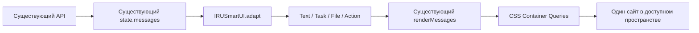

# Unified Smart UI v1 — этап A

Итог на 09.10.2026: реализован только сайт. По отдельной команде пользователя изменения опубликованы в `codex/agentshell-webview`; PR и merge не выполнялись. Требуется приёмка этапа A перед Windows Widget.

## 1. Исходный и итоговый HEAD

На момент реализации и проверок оба HEAD: `5905a29bb129c46ba4805348448e4701ef48e686`. Итоговый commit публикации доступен через `git log -1 --oneline` ветки `codex/agentshell-webview`. Контрольный `a55512b2e21a6448689bbdeda4d35ff6b4136589` отличается от исходного HEAD только ранее согласованным пакетом аудита P0-03. Производственный instrumentation diff P0-03 не применён.

Публикация Smart UI выполнена после отдельного разрешения пользователя. Код сервера, Windows Agent, WebView2, Qt/HWND, Browser Bridge и voice controllers не менялся.

## 2. Изменённые файлы

| Файл | Назначение |
| --- | --- |
| `ui/js/smart-ui.js` | Детерминированный adapter, явные таблицы статусов, registry четырёх блоков, безопасное отображение |
| `ui/js/chat.js` | Интеграция в прежний renderMessages, сохранение task_receipt/status, переиспользование operations/PLAN/actions, восстановление раскрытий/прокрутки/черновика |
| `ui/js/core.js` | Один Set состояния раскрытия внутри существующего state |
| `ui/js/mobile-header.js` | Навигация использует ширину appRoot, а не viewport/media match |
| `ui/index.html` | Подключение adapter перед chat.js и компактная идентичность ИРУ |
| `ui/css/smart-ui.css` | Container queries, layout четырёх блоков и приоритет подтверждений |
| `ui/style.css` | Подключение нового CSS после существующего оформления |
| `tests/smart-ui.test.cjs` | Данные, статусы, evidence, безопасный fallback и отсутствие действий из текста |
| `tests/smart-ui-browser.test.cjs` | Реальный renderer, размеры, resize/voice/API invariants, раскрытие, PLAN, confirm/cancel, scroll anchor |
| `tests/helpers/smart-ui-fixtures.cjs` | Синтетические данные и локальный mock transport для тестов/демо |
| `tools/smart_ui_demo.cjs` | Воспроизводимая демонстрация одного настоящего сайта |
| `docs/IRU-Smart-UI-stage-A.md` | Этот отчёт |

## 3. Adapter → registry → layout



Это внутренняя view model сайта; backend protocol не изменён. Второго message renderer, state manager или voice loop нет. Registry возвращает содержание для единственного renderMessages. Прежние компоненты операций, шагов PLAN и действий вызываются из блока Task/Action.

## 4. Четыре блока и источники данных

| Блок | Источники | Поведение |
| --- | --- | --- |
| Text | content/text, полученные из answer/истории | Исходные символы и переносы строк; HTML экранируется; длинный текст визуально ограничен с раскрытием оригинала |
| Task | taskStatus/task_receipt/overall_status, tasks/steps, commands, liveTasks/liveCommands, terminal answer metadata | Одно представление задачи с раскрываемыми операциями, PLAN и деталями |
| File | Подтверждённые write_content, transfer_file, get_file_link и existing download metadata | Имя/тип/устройство, раскрытие пути, скачивание прежним механизмом |
| Action | confirmTaskId/commandConfirmation, planReview/revision, существующее состояние отмены/предложений памяти и PLAN | Прежние обработчики и endpoints; render ничего не исполняет |

Для Task есть явные таблицы соответствия waiting/running/success/partial/blocked/failed/cancelled. `goal_completed=false` и partial/blocked не превращаются в success после удачной команды. Когда ordinary runtime.status=done означает только завершение отчёта, структурированные terminal partial_report/report_failure сохраняют partial/failure. Неустранённые структурированные terminal protocol/auditor/budget failures также не становятся success только из runtime.done. Вложенные tasks/steps с failed/partial/blocked имеют приоритет перед runtime.done и слабым receipt. Перекрыть устаревшие негативные подробности может только успешный итоговый receipt с final_verification_status=verified либо goal_completed=true; goal_completed=false и failed verification всегда исключают успех. Исторические ошибки не перекрашивают подтверждённый recovered PLAN в failure.

Статус операции проверяет status/returncode, включая failed/unknown/not_found. Отсутствие error не равно success. Неизвестная операция получает нейтральный значок вместо галочки. Partial поддерживается и в прежних раскрытых деталях, а при отсутствии шагов не рисуется вымышленный процент выполнения.

File не создаётся из фразы «Я создал файл», shell stdout или произвольной ссылки. Write требует успешного structured command и bytes_written/path/device; transfer — success/sha256_verified/target path/device. Настоящий get_file_link поддержан по structured result.url/result.file_path и device_id/target_device_id. Поддерживается его legacy-форма без отдельного status; explicit failed/pending/error отвергаются. При клике обновляется token прежним POST /api/download_request, исходная ссылка из текста не становится доверенной. Дубликаты device+path объединяются. URL в тексте не превращается в фиктивный download link. Клик вызывает существующий downloadMessageFile с точным устройством и путём; текущий выбранный ПК не подменяет target. Файл автоматически не загружается.

## 5. Адаптация к пространству

Основные контейнеры: `appRoot` для оболочки и `.chat-view` для содержимого. Их ширина, а не ОС/User-Agent, управляет Smart UI.

- До 360 CSS px: короткое представление Text, вертикальные кнопки, компактные Task/File.
- До 720 CSS px: исходный длинный текст и операции можно раскрыть; путь файла раскрывается отдельно.
- Шире 720 CSS px: полный текст, операции и сведения об артефакте доступны в развёрнутой форме.
- Навигационная оболочка сворачивает постоянную sidebar до 980 px: это отдельный порог размещения прежних header controls, а не дополнительный UI-режим.

При 768 px viewport фактический контейнер содержимого может быть шире 720 px; тесты используют реальный размер контейнера, а не название устройства.

Новых resize handlers/ResizeObserver, циклов animationFrame или повторных DOM builds на каждый пиксель нет. CSS меняет layout, не state. На resize не создаются API/LLM/TTS/polling calls и не меняется SpeechRecognition. Доказано тестом узкого appRoot внутри viewport 1280 px: DOM nodes, messages, confirmation и active voice session сохраняются.

Все исходные данные остаются в DOM/state. Обрезание применяется только к Text с кнопкой раскрытия; средний текст без кнопки не обрезается. Раскрытия хранятся в существующем state, черновик PLAN/selection и command раскрытия восстанавливаются при обычном rerender. При чтении истории сохраняется видимый message anchor; в конце разговора продолжается привычное следование новым сообщениям.

Новые блоки используют палитру и JetBrains Mono из base.css; scope новых блоков сохраняет эти значения поверх прежнего product-v2 оформления. Desktop shell целиком не перекрашивается. Reduced motion поддержан. Новых бесконечных декоративных анимаций нет; гарантий FPS не заявляется.

## 6. Обратная совместимость и безопасность

Сохранены авторизация, device selection, обычный чат, admin usage visibility, PLAN review/revision, подтверждение/отказ/отмена, memory/PLAN предложения, технические детали и файловый download API. API/body/nonce/revision для действий не заменялись. Действия возникают только из существующего structured состояния, не из свободного текста модели.

Опасное подтверждение находится вне раскрываемых Task details и декоративного меню; кнопки остаются видимыми в компактном пространстве. Его единственная рамка и заголовок размещены в Action, без повторного внутреннего баннера.

Backend остаётся ответственным за ownership, scope, confirmation/idempotency и evidence. UI не ослабляет permissions и не запускает tools самостоятельно.

## 7. Проверки и точные команды

Окружение: bundled Python/Node, тестовые Python dependencies; Playwright использует headless Edge. Backend/агенты/providers заменены mocks, Windows desktop tests без необходимых Qt/WebView2 dependencies пропущены. Системные действия на пользовательских устройствах и платные API не выполнялись.

```powershell
$py = 'C:/Users/russa/.cache/codex-runtimes/codex-primary-runtime/dependencies/python/python.exe'
$node = 'C:/Users/russa/.cache/codex-runtimes/codex-primary-runtime/dependencies/node/bin/node.exe'
$env:NODE_PATH = 'C:/Users/russa/.cache/codex-runtimes/codex-primary-runtime/dependencies/node/node_modules'
$env:IRU_TEST_PYTHON = $py
$env:PYTHONPATH = "$env:TEMP/iru-audit-20261002/deps"
$env:PYTHONDONTWRITEBYTECODE = '1'
$env:PYTHONIOENCODING = 'utf-8'
```

JS suite:

```powershell
$files = (Get-ChildItem -Path tests -Filter '*.test.cjs' -File).FullName
& $node --test @files
```

Отдельно актуальные UI проверки:

```powershell
& $node --test tests/smart-ui.test.cjs tests/smart-ui-browser.test.cjs tests/plan-log-outcome.test.cjs tests/settings-ui.test.cjs
```

Python suite запускается в двух процессах из-за существующего конфликта импорта agent.py и agent.shell при общей collection:

```powershell
& $py -m pytest -q --ignore=tests/test_agent_shell_config.py --ignore=tests/test_agent_shell_tray.py --basetemp "$env:TEMP/iru-smart-ui-full-20261008"
& $py -m pytest -q tests/test_agent_shell_config.py tests/test_agent_shell_tray.py --basetemp "$env:TEMP/iru-smart-ui-shell-20261008"
```

Получено 1012 passed / 14 skipped и отдельно 11 passed: весь набор Python tests покрыт двумя запусками, skipped перечислены как ограничения окружения. Не утверждается, что единый `pytest -q` проходит без конфликта collection. После финальных изменений UI также повторены связанные tests — 122 passed; они являются подмножеством suite, не добавляются к общему числу.

```powershell
& $py -m pytest -q tests/test_tool_usage_ui.py tests/test_settings_and_offline_memory.py tests/test_confirmed_command_outcome.py tests/test_pipeline_plan_review.py tests/test_plan_confirmation_continuation.py tests/test_device_isolation.py tests/test_voice.py tests/test_voice_brief.py --basetemp "$env:TEMP/iru-smart-ui-final-20261009"
```

Прежний mobile smoke прошёл пять размеров: 320×568, 390×844, 430×932, 740×390, 1440×900. Запускался с локальной статикой на 8769 и mock API:

```powershell
& $py -m http.server 8769 --bind 127.0.0.1 --directory ui
# В другом терминале:
& $node tests/mobile-browser-smoke.cjs
```

`node --check` для изменённых JS и `git diff --check` также проверяются. Последний полный JS-прогон: 144 passed, 0 failed. Финальные browser UI/Settings tests: 18 passed. С adapter и PLAN outcome tests актуальные UI проверки: 32 passed. git diff --check: exit 0.

Во время разработки browser tests нашли перекрытие интерфейса закрытой memory panel и отсутствие раскрытия текста; исправлены. Один расширенный Browser Bridge тест первоначально упал из-за Python без FastAPI; запуск с IRU_TEST_PYTHON/PYTHONPATH исправил environment failure. Failures не замалчиваются и не выдаются за успешную production проверку.

## 8. Воспроизводимая демонстрация

```powershell
& $node tools/smart_ui_demo.cjs
```

Открыть `http://127.0.0.1:8770`. Один index.html, один renderMessages, одинаковые mock data. Менять ширину окна/DevTools: 320, 480, 1280 px; содержимое можно прокручивать и раскрывать. Mock включает текст, running, completed, P0-02 blocked/partial, File и опасное подтверждение. Confirm/cancel/download остаются локальными демонстрационными ответами; реального бинарного DOCX нет, download честно возвращает mock error. Голос в этой standalone демонстрации недоступен; отдельно его lifecycle проверен FakeRecognition в browser tests без STT/TTS.

Если порт занят, задать другой через `$env:PORT`. Для остановки локального demo использовать Ctrl+C в его терминале. Авторизация синтетическая и действует только на localhost origin.

Снимки созданы существующим renderer в тесте; отдельные макеты для размеров не рисовались. Сохранены начало разговора и положение с File/partial/опасным подтверждением: `smart-ui-320.png`, `smart-ui-480.png`, `smart-ui-1280.png`, а также `*-actions.png`. Они лежат в каталоге артефактов этой задачи, пути даны в финальном ответе.

## 9. Полностью работающие функции и fallback

Полностью в рамках этапа A: четыре типа, данные без смыслового пересказа, container layout, раскрытия, Task/PLAN operations, прежние action APIs, File download dispatch с явным target, сохранение UI state и отсутствие lifecycle side effects resize.

Консервативный fallback:

- Журнал с одними step_index не превращается в выдуманный полный PLAN или процент: при отсутствии реальных tasks/steps показываются операции.
- История без overall receipt/task status не получает придуманный success только из successful intermediate command; показывается неподтверждённый результат.
- Файлы, созданные shell scripts без структурированного file evidence, остаются текстом/операциями. Их stdout не парсится в artifact.
- Нет document viewer или автоматической передачи generated files.
- Кнопка File использует прежние ограничения server/agent download; существование старого файла повторно проверяется backend при клике.
- Legacy text сохраняется как текст; произвольные HTML и строковые download URLs не исполняются.
- Браузеры без Container Queries сохраняют полное содержание/прежнюю viewport адаптацию; специфическая narrow-container компоновка там не заявляется.

## 10. Обнаруженные ограничения

Сервер не сохраняет весь task_receipt внутри каждого legacy chat message. Поэтому восстановленный historical Task может иметь меньше данных о полной цели, чем live Task. Frontend не пытается обходить это реконструкцией success по прозе. Добавление persisted receipt — отдельное backend решение, не часть этапа A.

Реальные телефонные браузеры, физические устройства, реальные files/LLM/STT/TTS и нативный WebView2 не проверялись в этом этапе. Проверены actual headless browser layout и прежние mocked contracts; 14 native desktop tests пропущены по доступности dependencies. Это не утверждение о production readiness Windows Widget.

## 11. Diff

Полный текстовый patch включает tracked и новые файлы и предоставлен отдельным артефактом `IRU-Smart-UI-stage-A.diff`. Commit/push выполнены по отдельному разрешению пользователя; PR не создавался. Изменения ограничены UI, тестами, mock demo и этим отчётом.

## 12. Следующий этап

После приёмки этапа A подключить этот же сайт к существующему единственному WebView2 компактному контейнеру. Не делать отдельный интерфейс/store/document/voice loop. Сначала проверить actual CSS width/DPI/height, доступность actions, фокус, auth persistence, голосовые permissions и download на native runtime. Изменения HWND/Qt/window/tray согласовываются отдельно. Этап B сейчас не выполнялся.

## Дополнительная проверка get_file_link / приоритетов taskState

После двух замечаний пользователя добавлены unit и browser regressions: normalized и legacy get_file_link; непризнание prose/внешней ссылки; точный target при download; отсутствие запросов при render; вложенные негативные статусы против done/weak receipt; verified recovered receipt против устаревших подробностей; goal_completed=false и failed verification. Раскрытые подробности используют тот же нормализованный результат, без изменения исходных данных.

```powershell
& $node --test tests/smart-ui.test.cjs tests/plan-log-outcome.test.cjs tests/smart-ui-browser.test.cjs
& $py -m pytest -q tests/test_tool_usage_ui.py tests/test_controller_trust.py tests/test_confirmed_command_outcome.py tests/test_pipeline_recovery_receipt.py tests/test_device_isolation.py --basetemp "$env:TEMP/iru-smart-ui-links-priority-20261009"
```

Backend, download API, owner/device routing, confirmations и voice не изменены. Commit/push разрешены отдельной командой пользователя после этих проверок.
